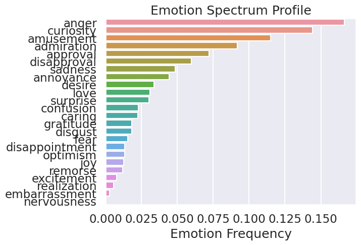
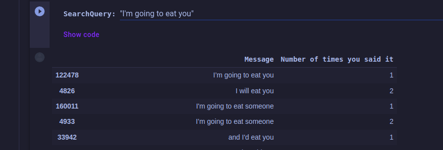
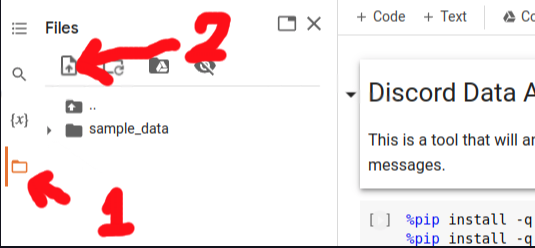

# discord-data-analyzer

Using advanced techniques to analyze discord data and expose you or your friends for the terrible people you are

## Emotion and Semantic Analysis

  

[Colab Link](https://colab.research.google.com/github/codekisser/discord-data-analyzer/blob/main/analyzer.ipynb)

## Search Messages

Search all of your messages using a method much more powerful than `CTRL+F`

  

[Colab Link](https://colab.research.google.com/github/codekisser/discord-data-analyzer/blob/main/search.ipynb)

Credit: [codekisser](https://codekisser.com)

## How to use

### Getting Your Discord Data
1. Go on discord -> User Settings -> Privacy & Security -> "Request all of my Data"
2. Discord will eventually send you an email with a link that will let you download your "package.zip". It contains all of your discord data and all the messages you have ever sent.

### Prepare Google Colab

1. In the toolbar at the top of this page, click on the Runtime drop down menu
2. "Change Runtime Type"
3. Select "GPU"

### Upload Your Discord Data To The Notebook
1. Go to the "Files" tab on the left of this page.

> 
2. Upload your "package.zip" file
3. **Wait for "package.zip" to actually finish uploading.** There will be a progress bar at the bottom of the page. "package.zip" will show up in the folder, but it might not be finished uploading. If you get an error saying that package.zip is not a zip file, that means that it wasn't finished uploading.

### Run this notebook
1. In the toolbar at the top of this page, click on the Runtime drop down menu
2. "Run all"

OR press `CTRL + F9`

### Making Queries

In certain parts of the program, you can do searches for specific terms. These searches use "regex".

Regex is pretty complex but you really only need to know one thing:

"man|male" means "man or male". "man|male" will match with messages that contain either "man" or "male".

Bonus points:

? means a character is optional. "Whites?" matches "White" or "Whites", "(neo)?vim" matches "neovim" or "vim".

[abcd] matches any character in the backets. "M[ae]n" matches "Man" and "Men".

Regex is important if you're a programmer. This is a good chance to learn it.

Use this to your advantage when it comes to synonyms and like-terms. If you want data that describes your sentiment of the male gender, you will want to create as large of a net as possible in order to get more data. More data = more accurate.

Whether it is uppercase or lowercase does not matter. Case is ignored.
